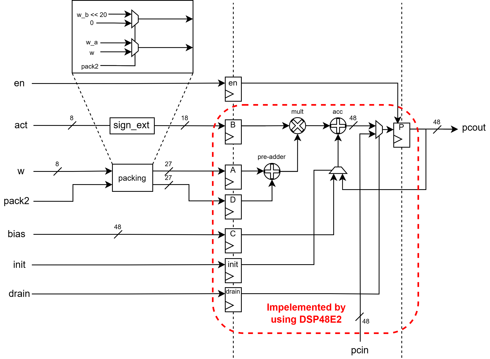
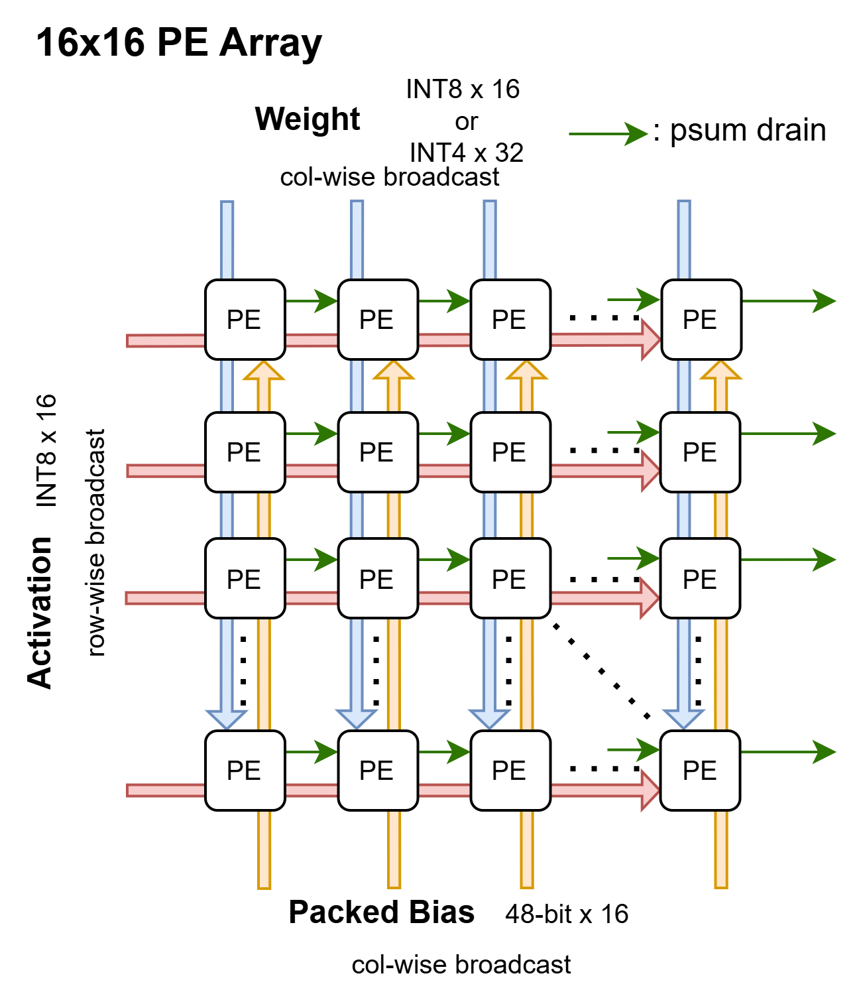

# PE & 16×16 PE Array (DSP48E2)

INT8/INT4 output-stationary MAC 셀(`pe.sv`)과 이를 16×16으로 깐 배열(`pe_array_16x16.sv`).
누산은 DSP 내부(P 레지스터), bias는 C 포트 preset, drain은 cascade shift.

---

## 1. PE 셀 (`rtl/pe.sv`)



DSP48E2 **1개**로 구현. 두 모드:
- **pack2=1**: INT8 act × **두 INT4 weight**를 한 번의 곱에 packing → **2 MAC/DSP**
- **pack2=0**: INT8 act × INT8 weight 1개 → **1 MAC/DSP**

### 포트
| 포트 | 폭 | 설명 |
|------|----|------|
| `act` | 8 | INT8 활성 → sign_ext → B 포트 |
| `w` | 8 | pack2=1: `{w_b[3:0], w_a[3:0]}` 두 INT4 / pack2=0: INT8 하나 |
| `pack2` | 1 | packing mux 선택 |
| `bias` | 48 | packed bias → **C 포트** (init 때만 사용) |
| `init` | 1 | 타일 시작: `P ← M + bias` (아니면 `P ← P + M`) |
| `en` | 1 | 누산/shift enable → **CEP** (0이면 P 홀드, drain 중 1 유지) |
| `drain` | 1 | SHIFT 모드: `P ← pcin` (cascade readout) |
| `pcin` | 48 | 왼쪽 PE의 pcout (drain shift-in) |
| `pcout` | 48 | = P; 오른쪽 PE의 pcin / 체인 끝은 readout |

### 동작 (OPMODE Z-mux 전환, ALUMODE=add 고정)
| 모드 | 조건 | Z | P ← | OPMODE |
|------|------|---|-----|--------|
| **INIT** | `init` | C | M + bias | `9'b000110101` |
| **ACCUM** | else | P | P + M | `9'b000100101` |
| **SHIFT** | `drain` | PCIN | pcin | `9'b000010000` |

`assign opmode = drain ? SHIFT : (init ? INIT : ACCUM);`

### weight packing (그림 좌상단 inset)
pre-adder(D+A)로 두 weight를 gap-20 packing:
- `D = pack2 ? (w_b << 20) : 0`, `A = pack2 ? w_a : w`
- → `(D+A) × act = (w_b·act)<<20 + w_a·act` → P의 **저 field[19:0] = Σw_a·act, 고 field[47:20] = Σw_b·act**
- 곱 max = 127×7 = 889 → 512 누산해도 저 field 2^18.8 < 2^19 (gap-20 안전)

### bias (C 포트)
- pre-adder는 weight가 쓰므로 bias는 **C 포트에 fabric에서 미리 packing**: `C = (bias_b<<20) + bias_a`
- INIT에서 `Z=C` → `P = M + C` → bias가 두 field에 함께 누적
- bias_int32가 작아(~수십) 저 field에 여유롭게 fit

### 출력 unpacking (밖에서)
`pcout`은 **raw 48-bit P**. borrow 보정·field 분리는 **downstream(wrapper)** 에서:
```
acc0 = pack2 ? $signed(P[19:0])                      : P[31:0]   // Σw_a·act (+bias_a)
acc1 = pack2 ? $signed(P[47:20]) + P[19] /*borrow*/  : 0         // Σw_b·act (+bias_b)
```

### 파이프라인 / 정렬
- **입력 레지스터 on** (AREG/BREG/DREG=1), 곱 조합(MREG=0), **P가 누산기**(PREG=1)
- **OPMODEREG=1**: `init`/`drain`이 입력-레지스터 지연된 곱과 ALU에서 정렬 → latch 불필요
- **en_latch** (fabric FF 1단): `en`을 OPMODE와 같은 1-cycle 지연으로 맞춰 CEP 구동
- latency: 입력핀 → P 유효 **2 cycle**
- **마지막 곱**: en_latch(CEP=en 1 지연) + MREG=0(mult→P 1cyc)이 맞물려, 마지막 feed **다음 cycle**에 자동 누산 → readout/flush 때 **en 불필요** (tb_pe에서 en=0 flush로 검증)

---

## 2. 16×16 PE Array (`rtl/pe_array_16x16.sv`)



256 PE, output-stationary. GEMM `C[r][c] = Σ_k A[r][k]·W[c][k] (+ bias_col[c])`.

### broadcast dataflow
| 신호 | 방향 | 폭 |
|------|------|----|
| **Activation** (`act_row[16]`) | **row-wise** (각 row에 1개, 좌→우 열 공유) | INT8 × 16 |
| **Weight** (`w_col[16]`) | **col-wise** (각 col에 1개, 상→하 행 공유) | INT8×16 또는 INT4×32 |
| **Packed Bias** (`bias_col[16]`) | **col-wise** (feature=col당 1개, C 포트) | 48-bit × 16 |
| `init/en/drain/pack2` | 전체 broadcast | 1 |

### cascade drain (psum drain, 좌→우)
- 누산 후 `drain=1` → SHIFT로 **P를 좌→우로 shift** (`pcin[r][0]=0`, `pcout[r][c]→pcin[r][c+1]`)
- **오른쪽 끝 `p_drain[r] = pcout[r][15]`** 를 매 cycle 읽음
- 16 cycle 동안 **col 15 → 14 → … → 0** 순서로 나옴 (row 16개씩 병렬)

### tile 크기
| 모드 | 한 tile 출력 |
|------|-------------|
| pack2=1 | 16 token × **32 feature** (PE당 2) |
| pack2=0 | 16 token × 16 feature |

### 제어 분담
`pe_array`는 **stateless fabric** (FSM/카운터 없음). "몇 cycle 누산(K)·언제 drain" 등 시퀀싱은 **상위 wrapper(gemm_core)** 담당.

---

## 3. 검증

| tb | 대상 | 결과 |
|----|------|------|
| `sim/tb_pe.sv` | PE 셀 | pack2/single(K=128·512) + bias + en-hold + drain shift — **ALL PASS** |
| `sim/tb_pe_array.sv` | 16×16 배열 | GEMM 누산 + bias + cascade drain (pack2/single) — **ALL PASS** |

빌드: `xvlog -sv ../rtl/*.sv tb_*.sv` → `xelab -L unisims_ver -L secureip <top> glbl` → `xsim <snap> -R`
(DSP48E2 unisim + glbl 필요, `pe.sv`에 `timescale` 포함)
